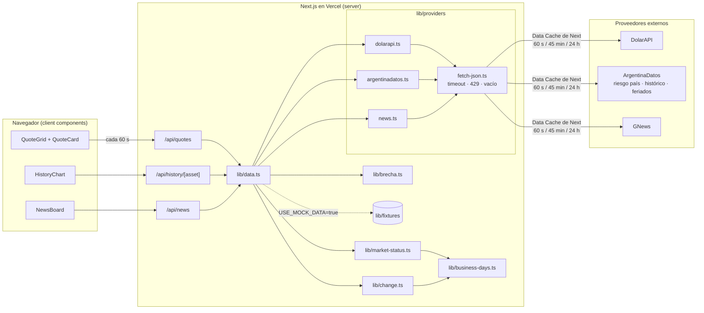

# Arquitectura — Tablero de mercado

Documento técnico del challenge de Rubika. Primera versión aprobada el 27/09/2026 antes de la primera línea de código; revisada el 28/09 con las respuestas reales de las APIs. Las decisiones de producto están en `docs/producto.md` y `CLAUDE.md`; acá va cómo se construye.

---

## 1. Vista general



Tres reglas que ordenan todo:

1. **Los route handlers son de pocas líneas y solo llaman a `lib/data.ts`.** La lógica vive en `lib/` y se testea sin levantar Next.
2. **Los componentes no calculan nada.** Reciben datos listos (brecha, variación y estado de mercado ya resueltos) y eligen qué estado mostrar.
3. **Nada de `components/` importa de `providers/`.** Las claves solo se leen en `providers/`, que solo se importa desde el server.

---

## 2. Estructura de carpetas

```
/
├── CLAUDE.md, README.md, .env.example
├── docs/
├── src/
│   ├── app/
│   │   ├── layout.tsx            shell + disclaimer fijo
│   │   ├── page.tsx              compone QuoteGrid, HistoryChart, NewsBoard
│   │   └── api/
│   │       ├── quotes/route.ts
│   │       ├── history/[asset]/route.ts
│   │       └── news/route.ts
│   ├── lib/
│   │   ├── types.ts              Quote, HistoryPoint, NewsItem, MarketStatus, Result
│   │   ├── result.ts             ok() / fail()
│   │   ├── fetch-json.ts         fetch con timeout, 429 y vacío → Result
│   │   ├── providers/
│   │   │   ├── dolarapi.ts
│   │   │   ├── argentinadatos.ts riesgo país, histórico, feriados
│   │   │   └── news.ts           GNews
│   │   ├── business-days.ts      función pura: días hábiles (fin de semana + feriados). Única fuente de verdad
│   │   ├── market-status.ts      función pura: (now, feriados) → MarketStatus
│   │   ├── change.ts             función pura: variación del día contra el cierre hábil anterior
│   │   ├── brecha.ts             funciones puras: calcBrecha, brechaSeries
│   │   ├── data.ts               getQuotes / getHistory / getNews: mock o real, arma la respuesta
│   │   └── fixtures/
│   │       ├── raw/              respuestas reales bajadas con curl (evidencia; no se importan desde código)
│   │       ├── quotes-normal.json, quotes-viernes-cerrado.json, quotes-sin-oficial.json
│   │       ├── history-<asset>.json   últimos 60 días de cada serie
│   │       ├── news.json
│   │       └── feriados.json
│   └── components/
│       ├── QuoteGrid.tsx, QuoteCard.tsx
│       ├── HistoryChart.tsx      Recharts, selector 7/30/90
│       ├── NewsBoard.tsx
│       ├── StateMessage.tsx      un componente, 3 variantes: carga / error / sin datos
│       ├── MarketBadge.tsx       "Actualizado hace X min" o "Último cierre: día y hora"
│       ├── MockBanner.tsx        "Datos de demostración, no reflejan el mercado"
│       └── Disclaimer.tsx
└── tests/
    ├── unit/                     Vitest: business-days, change, market-status, brecha, adaptadores con MSW
    └── e2e/                      Playwright: happy path en modo mock
```

---

## 3. Proveedores: formato real verificado

Respuestas bajadas con curl el 28/09/2026 y guardadas en `src/lib/fixtures/raw/`. Los adaptadores se escriben contra estos formatos, no contra la documentación.

| Archivo | Forma | Campos y tipos | Fecha | Registros |
|---|---|---|---|---|
| `dolarapi-dolares.json` | array | `moneda` str, `casa` str (oficial, blue, bolsa, contadoconliqui, mayorista, cripto, tarjeta), `nombre` str, `compra` number, `venta` number (enteros o con decimales), `fechaActualizacion` str | ISO 8601 con hora, UTC | 7 |
| `argdatos-riesgo-ultimo.json` | objeto | `valor` int, `fecha` str | `YYYY-MM-DD`, sin hora | 1 |
| `argdatos-blue-historico.json` | array | `casa` str, `compra` int, `venta` int, `fecha` str | `YYYY-MM-DD` | 5.748: todos los días calendario desde 2011, sin huecos, fines de semana repiten el valor del viernes, ascendente, sin duplicados, ~0,5 MB |
| `argdatos-riesgo-historico.json` | array | `valor` int, `fecha` str | `YYYY-MM-DD` | 7.710: solo días hábiles desde 1999, huecos en fines de semana y feriados, ascendente, sin duplicados, ~0,4 MB |
| `argdatos-oficial-historico.json` | array | igual al blue; `compra`/`venta` enteros o con decimales | `YYYY-MM-DD` | 5.748, calendario completo desde 2011, sin nulos |
| `argdatos-bolsa-historico.json` (MEP) | array | igual al blue | `YYYY-MM-DD` | 2.892, calendario completo desde 2018-10, sin nulos |
| `argdatos-tarjeta-historico.json` | array | igual al blue. `tarjeta` no figura en la doc de ArgentinaDatos pero el endpoint responde | `YYYY-MM-DD` | 2.472, calendario completo desde 2019-12, sin nulos |
| `argdatos-feriados.json` | array | `fecha` str, `tipo` str (inamovible, trasladable, puente), `nombre` str. Endpoint por año: `/v1/feriados/{año}` | `YYYY-MM-DD` | 19 (año 2026) |
| `gnews-search.json` | objeto | `totalArticles` int, `articles[]` con `id, title, description, content, url, image, publishedAt` str, `lang` str, `source: {id, name, url, country}` | ISO 8601 con hora, UTC (`...Z`) | 10 (max=10). La nota más nueva tenía ~32 h al momento del curl: consistente con la demora del plan gratis |

Consecuencias directas:

- **MEP se llama `bolsa` en DolarAPI.** El mapeo `AssetId → casa` vive en `dolarapi.ts`.
- **Las series de dólar traen todos los días calendario; la de riesgo país solo días hábiles.** Ninguna comparación se hace por índice del array.
- **La entrada de fecha D es una foto tomada en D, no el cierre de D.** Se ve en oficial y MEP: el sábado 26/09 ya lleva el valor que DolarAPI muestra el lunes 28, distinto al del viernes 25. Consecuencia para `changePct`: ver §8.
- **Feriados se piden por año.** El adaptador pide el año en curso; entre Navidad y Año Nuevo el fallback a fixture cubre el hueco (riesgo menor, anotado).
- **El riesgo país no trae hora** y en día hábil no aparece el valor del día hasta el cierre. Su tarjeta muestra "Dato del DD/MM" en lugar de "actualizado hace X min"; `Quote.updatedAt` lleva la fecha a medianoche ART y `Quote.updatedAtHasTime: false` para que la UI elija la leyenda.
- **La serie completa nunca viaja al navegador** (ver §6).

Descartados tras verificar: `turista` (404) y `solidario` (serie terminada en 2023-12).

---

## 4. Carga de datos en el cliente

**Decisión:** los componentes del tablero son client components y hacen fetch a los route handlers desde el arranque. `QuoteGrid` refresca `/api/quotes` cada 60 s, alineado con la cache del server.

**Alternativa descartada:** server component con datos en el primer render + refresco cliente. Evita un round trip inicial, pero duplica el camino de datos y vuelve teórico el estado de "carga", que es un criterio de aceptación explícito. Se priorizó calidad y verificabilidad sobre milisegundos de primer render.

---

## 5. Tipos propios

```ts
type AssetId = 'blue' | 'mep' | 'oficial' | 'tarjeta' | 'riesgo-pais';

type Result<T> =
  | { ok: true; data: T }
  | { ok: false; error: { kind: 'timeout' | 'rate-limited' | 'upstream' | 'empty' | 'invalid'; message: string } };

interface Quote {
  asset: AssetId;
  label: string;               // "Dólar blue", "Riesgo país"
  unit: 'ARS' | 'puntos';
  buy: number | null;          // null en riesgo país
  sell: number;                // valor principal; en riesgo país es el índice
  changePct: number | null;    // variación vs cierre del día hábil anterior; null si no se pudo calcular
  gapVsOficial: number | null; // brecha %, un decimal; null en oficial, riesgo país, u oficial ausente
  updatedAt: string;           // ISO, hora del dato según el proveedor
  updatedAtHasTime: boolean;   // false en riesgo país (el proveedor da solo fecha)
  source: 'DolarAPI' | 'ArgentinaDatos';
}

interface MarketStatus {
  isOpen: boolean;
  reason: 'open' | 'weekend' | 'holiday' | 'outside-hours';
  lastCloseAt: string;         // ISO del último cierre (día hábil anterior, 18:00 ART)
  holidaysSource: 'live' | 'fallback-fixture';
}

interface QuotesResponse {
  quotes: Record<AssetId, Result<Quote>>; // falla por activo, no por tablero
  market: MarketStatus;
  fetchedAt: string;
  mock: boolean;
}

interface HistoryPoint { date: string; value: number }   // date en YYYY-MM-DD

interface HistoryResponse {
  asset: AssetId;
  range: 7 | 30 | 90;
  series: HistoryPoint[];             // precio de venta (o índice)
  gapSeries: HistoryPoint[] | null;   // brecha; null si el activo no es un paralelo
  market: MarketStatus;
}

interface NewsItem {
  id: string;
  title: string;
  source: string;
  publishedAt: string;
  url: string;
  lang: 'es' | 'en';
  topic: 'dolar' | 'bcra' | 'fed' | 'inflacion' | 'riesgo-pais' | 'mercados';
}
```

**Por qué el estado de mercado va en `QuotesResponse.market` y no en cada `Quote`:** `CLAUDE.md` cierra una ventana única de mercado para todos los activos. Repetir el flag en cinco `Quote` es duplicar un dato y abrir la puerta a inconsistencias. Si en próximos pasos se implementan ventanas por activo, el campo se mueve a `Quote` y la UI no cambia.

**Por qué `Result` por activo:** un proveedor caído no puede tirar el tablero entero (H0-5). Cada tarjeta muestra su propio estado; las demás siguen.

---

## 6. Contratos de route handlers

Los tres devuelven **siempre HTTP 200 con el `Result` en el body**. El error de un proveedor es un estado de la UI, no una excepción. Única excepción: `400` cuando `asset` o `range` son inválidos (error de programación, no de proveedor).

| Endpoint | Devuelve | Sin datos | Error | Cache-Control |
|---|---|---|---|---|
| `GET /api/quotes` | `QuotesResponse` | `ok` con datos parciales | por activo | `s-maxage=60, stale-while-revalidate=300` si todos `ok`; `no-store` si alguno falló |
| `GET /api/history/[asset]?range=7\|30\|90` | `Result<HistoryResponse>` | `ok: true, series: []` | `ok: false` | `s-maxage=3600` |
| `GET /api/news` | `Result<{ items: NewsItem[]; fetchedAt }>` | `ok: true, items: []` | `ok: false` | `s-maxage=2700` |

"Sin datos" y "error" son valores distintos a propósito: son dos de los cuatro estados de UI que el producto exige visibles y distintos (H0-6).

**Histórico:** el server pide la serie completa **una vez por día** (revalidación 24 h sobre el `fetch` al proveedor), la recorta por fecha a los últimos 90 días calendario y recién eso sale al cliente; `range` recorta sobre esos 90. Se descartó recortar por cantidad de registros (31): las dos series tienen calendarios distintos (calendario completo vs. solo hábiles), así que "31 registros" no significa lo mismo en cada una, y no cubría el selector de 90 días.

---

## 7. Claves, cache y límites de uso

**Claves.** Solo `process.env.*` leído dentro de `lib/providers/*`. `.env.example` lista los nombres sin valores; `.gitignore` excluye `.env*` salvo `.env.example`. `.env.local` es solo local; en producción las variables se cargan a mano en el dashboard de Vercel. DolarAPI y ArgentinaDatos no requieren clave. GNews sí: `NEWS_API_KEY`.

**Cache, dos capas.**

1. *Data Cache de Next:* cada `fetch` a un proveedor lleva `next: { revalidate: N }`. En Vercel este cache es compartido entre invocaciones, así que N usuarios abriendo el tablero generan como máximo una llamada por ventana por endpoint upstream.
2. *CDN de Vercel:* header `Cache-Control` en la respuesta del route handler (tabla de §6) para absorber ráfagas sin ejecutar la función.

| Dato | Revalidación | Motivo |
|---|---|---|
| Cotizaciones (DolarAPI, riesgo país último) | 60 s | Decisión de producto. |
| Histórico (serie completa) | 24 h | Serie diaria de 0,4-0,5 MB por request; una vez por día alcanza. |
| Noticias (GNews) | 45 min | Plan gratis: 100 requests/día; dos búsquedas (es + en) cada 45 min → 64/día. |
| Feriados | 24 h | Cambia pocas veces al año. |

`USE_MOCK_DATA=true` saltea ambas capas y sirve fixtures.

**Límites de uso.** DolarAPI y ArgentinaDatos: sin límite documentado conocido; con la cache la exposición queda acotada. GNews: 100 requests/día en plan gratis, cubierto por los 20 min de cache. El manejo de 429 se implementa igual porque es criterio de aceptación.

**Timeout y errores.** `fetch-json.ts` es el único lugar que hace `fetch` a un proveedor: `AbortSignal.timeout(5000)`; timeout → `timeout`; HTTP 429 → `rate-limited`; otro ≥ 400 → `upstream`; body vacío o `[]` → `empty`; JSON que no cumple la forma esperada → `invalid`. Los adaptadores solo normalizan campos. Así el manejo de errores se escribe y se testea una sola vez.

**A verificar con un test:** que el Data Cache de Next no retenga respuestas con status ≥ 400 del proveedor. Si las retiene, un 429 quedaría "pegado" durante la ventana; la mitigación sería `cache: 'no-store'` condicional.

---

## 8. Días hábiles: una sola fuente de verdad

`business-days.ts` exporta funciones puras que reciben la lista de feriados como parámetro:

```ts
isBusinessDay(date: string, holidays: string[]): boolean      // no es sábado, domingo ni feriado
previousBusinessDay(date: string, holidays: string[]): string
```

La usan `market-status.ts` (para saber si hay mercado y cuál fue el último cierre) y `change.ts` (para saber contra qué día comparar). Ninguna otra parte del código decide qué es un día hábil.

### Variación del día (`change.ts`)

**Regla (cerrada el 28/09):** `changePct` compara el valor actual contra **la última entrada del histórico con fecha anterior a la fecha del dato actual**. Para el dólar (serie calendario completa) eso es la entrada de ayer, que en un domingo ya lleva el cierre del viernes; para riesgo país (solo hábiles) es la rueda anterior. No necesita lógica de días hábiles.

Historia de la regla, para `uso-de-ia.md`: primero se propuso "contra ayer" (falla: el lunes contra el domingo parecía dar 0 % siempre); después "contra el último valor distinto" (falla: en rachas sin movimiento compara contra varias ruedas atrás); después "contra el día hábil anterior" (falla: los crudos de oficial y MEP muestran que la entrada del sábado ya trae el cierre del viernes, así que el lunes daría un movimiento que no ocurrió). La regla vigente sale de mirar los cuatro históricos, no uno. Tests: lunes, día después de feriado, día normal, sin movimiento (0 %), sin dato anterior (`null`).

### Estado "mercado cerrado" (`market-status.ts`)

`getMarketStatus(now: Date, holidays: string[]): MarketStatus`. Función pura, sin fetch. Reglas en orden: hora Argentina = UTC−3 fijo (no hay horario de verano); sábado o domingo → `weekend`; fecha en `holidays` → `holiday`; hora < 10 o ≥ 18 → `outside-hours`; si no → `open`. `lastCloseAt` = 18:00 ART del `previousBusinessDay`.

Feriados: `argentinadatos.ts` los trae con cache de 24 h. Si falla, `data.ts` usa `fixtures/feriados.json` y marca `holidaysSource: 'fallback-fixture'`. La UI no muestra error por esto. Riesgo residual (va a `riesgos.md`): un feriado decretado después de generar el fixture, con ArgentinaDatos caído, mostraría mercado abierto un día sin mercado.

---

## 9. Brecha cambiaria sin duplicar lógica

`brecha.ts` contiene solo dos funciones puras:

```ts
calcBrecha(paraleloSell: number, oficialSell: number): number
// ((paralelo − oficial) / oficial) × 100, redondeado a un decimal

brechaSeries(paralelo: HistoryPoint[], oficial: HistoryPoint[]): HistoryPoint[]
// join por fecha; aplica calcBrecha a cada par; fechas sin contraparte se descartan
```

Se ejecutan solo en el server, en `data.ts`: `getQuotes` llena `gapVsOficial` de blue/MEP/tarjeta (o `null` si el oficial no vino, H1-4); `getHistory` llena `gapSeries` con el histórico del oficial. La tarjeta y el gráfico solo dibujan. Sin colores ni íconos de "bueno/malo".

---

## 10. Noticias: GNews

**Elegido:** GNews, plan gratis. 100 requests/día; las noticias llegan con **12 horas de demora** en el plan gratis (confirmado en su dashboard y en el crudo: la nota más nueva tenía ~32 h).

**Presupuesto de requests (cerrado el 28/09).** Una búsqueda es una request, y `lang` acepta un solo valor por request (verificado en la doc), así que una request por tema y por idioma (12 por refresco) no entra en 100/día con ninguna cache razonable. Decisión: **una búsqueda por idioma** con operadores OR (`dólar OR BCRA OR inflación OR "riesgo país" OR Fed OR mercados`, y su equivalente en inglés), tema asignado localmente por palabra clave en el título, y cache de **45 min** → 2 × 32 = 64 requests/día, con 36 de margen para desarrollo y demo. En desarrollo, `USE_MOCK_DATA=true` por defecto para no gastar cuota.

Opciones descartadas: solo español con 20 min (72/día; pierde las noticias en inglés del alcance base); español + inglés con 30 min (96/día; sin margen: un dev server con datos reales pasa el límite).

**Por qué no un segundo proveedor para repartir la cuota.** Sumar otra API de noticias resuelve el límite pero duplica el costo de mantenimiento: dos adaptadores, dos formatos de respuesta, dos límites de uso, dos claves, dos fuentes de error, y notas duplicadas entre fuentes que habría que deduplicar. El límite de 100/día es un problema de plan, no de arquitectura: si el producto avanza, se paga el plan de GNews (que además elimina la demora de 12 h) y el código no cambia. Preferimos un proveedor bien manejado a dos a medias.

Por qué 45 min no empeora la frescura: las noticias del plan gratis llegan con 12 horas de demora; refrescar cada 20 min en vez de cada 45 no las acerca al presente, solo gasta cuota.

Consecuencias: cada nota muestra "publicada hace X h" y el tablero nunca presenta noticias como última hora. La demora va a `docs/riesgos.md` y se cuenta en la demo.

**Descartados:** NewsData.io (misma demora, modelo de créditos más complejo), NewsAPI (plan gratis sin uso en producción), RSS de medios locales (sin demora ni key, pero más esfuerzo de parseo y normalización; queda como próximo paso).

Formato de respuesta verificado en `raw/gnews-search.json` (ver §3). `NewsItem.source` sale de `source.name`; `lang` del campo `lang`; `publishedAt` tal cual.

---

## 11. Modo mock (plan B)

`USE_MOCK_DATA=true` hace que `data.ts` lea de `lib/fixtures/` en vez de llamar a proveedores. `MOCK_SCENARIO=normal | viernes-cerrado | sin-oficial` elige el escenario. Cada fixture trae su propio `now` congelado, que alimenta a `getMarketStatus` y a "actualizado hace X": sin esto, el fixture de viernes mostraría mercado abierto un martes. Se descartó usar los timestamps reales con el reloj real. La respuesta lleva `mock: true` y la UI muestra un banner no ocultable: "Datos de demostración, no reflejan el mercado". Los fixtures se generan con `node scripts/build-fixtures.mjs` a partir de `raw/`; los crudos quedan como evidencia y no se importan desde código. **Conservan la forma de cada proveedor**, así el modo mock pasa por los mismos adaptadores que el modo real (los adaptadores quedan cubiertos también en la demo con plan B).

| Fixture | Contenido |
|---|---|
| `history-{oficial,blue,bolsa,tarjeta,riesgo-pais}.json` | Últimos 60 días de cada histórico, formato ArgentinaDatos. |
| `feriados.json`, `news.json` | Respuestas tal cual. |
| `quotes-normal.json` | `now` = lunes 28/09 10:00 ART; DolarAPI y riesgo país último, tal cual. |
| `quotes-sin-oficial.json` | Igual, sin la casa `oficial`. La brecha debe mostrar "no disponible". |
| `quotes-viernes-cerrado.json` | `now` = viernes 25/09 19:30 ART. No hay crudo de DolarAPI de ese día: se reconstruye con los valores del histórico del 25/09 y está marcado `derivadoDe`. |

---

## 12. Variables de entorno

| Variable | Dónde | Cuándo cargarla en Vercel |
|---|---|---|
| `NEWS_API_KEY` | `.env.local` / Vercel | Cuando el adaptador de noticias esté deployado; el "hola" del día 3 no depende de ella. |
| `USE_MOCK_DATA` | `.env.local` / Vercel | Al armar el plan B, en un deploy de preview separado de la URL principal. |
| `MOCK_SCENARIO` | `.env.local` / Vercel | Junto con la anterior. |

---

## 13. Pendientes que este documento deja abiertos

- Confirmar con un test el comportamiento del Data Cache ante respuestas de error.
